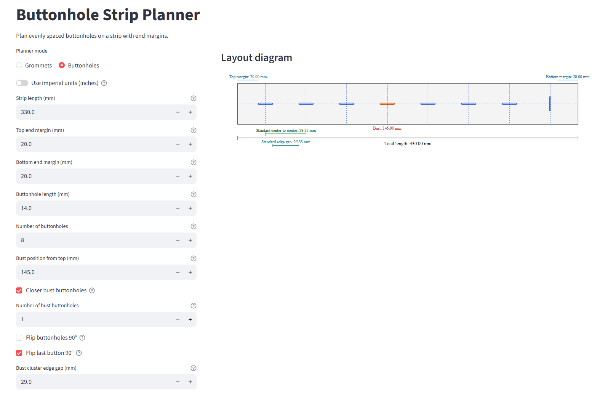

# Grommets and Buttonholes Planner

A small web app for two sewing layout problems:
- **Grommet mode**: evenly place grommets on a corset lacing strip
- **Buttonhole mode**: evenly place buttonholes on a shirt/placket strip, with optional bust-focused placement for women's shirts

**Use the app: [Grommets and Buttonholes Planner](https://grommet-planner.streamlit.app/)**

---

## The Problems It Solves

When placing grommets for lacing a corset or placing buttonholes on shirt, getting spacing right by hand is tedious. You have to account for:

- The total length of the strip
- A margin at each end
- The physical size of each feature (grommet diameter or buttonhole length)
- An even centre spacing along the strip
- Optional **closer local groups** at a target line:
	- On a corset, you may want to have some grommets closer at the waist
	- On a woman's shirt you may want to place a button at the bust line

This app does the maths instantly, shows exact centre marks and exports printable templates.

---

## Screenshots

---

## Features

### Planner mode
Use **Planner mode** to switch between:
- **Grommets**
- **Buttonholes**

The same core layout workflow is used in both modes, but labels and geometry update to match the selected feature type.

### Inputs (left panel)
| Field | What it does |
|---|---|
| **Strip length (mm)** | Total strip length |
| **Top / Bottom end margin (mm)** | Empty space at each end before the first/after the last feature |
| **Feature size (mm)** | In Grommet mode: external diameter. In Buttonhole mode: buttonhole length |
| **Number of features** | Total number of grommets/buttonholes |
| **Target line position (mm)** | Waist (Grommets) or Bust (Buttonholes), measured from top |
| **Closer line features** | Enable closer spacing at the waist/bust line |
| **Line cluster count** | Grommets: configurable waist count. Buttonholes: odd bust count (default: 1) |
| **Line cluster edge gap (mm)** | Edge-to-edge spacing between adjacent features in the closer cluster |
| **Flip buttonholes 90°** | Buttonhole mode only: rotates all buttonholes |
| **Flip last button 90°** | Buttonhole mode only, shown when full flip is off; enabled by default |

You can switch units with **Use imperial units (inches)**. The app converts automatically and keeps calculations precise internally.

### Layout diagram
A live SVG diagram in the app shows:
- The strip outline with top and bottom margins marked in blue (each shown independently)
- All features (circles for grommets, long thin rectangles for buttonholes)
- A horizontal centre line through all grommet centres
- A red dashed target-line marker (waist or bust)
- Dimension annotations: standard centre-to-centre, standard edge gap, line-cluster centre-to-centre, and line-cluster edge gap

In Buttonhole mode, buttonholes are rendered with a long-thin ratio and can be orientation-mixed using the flip options.

### Metrics
Key measurements are displayed in a summary row:
- Number of features, first centre, last centre, target line position
- **Center spacing** broken down into Top / Line cluster / Bottom
- **Edge-to-edge gap** broken down the same way

### Centre positions table
A precise table listing every feature with:
- **Position** from the strip start (in mm or inches, based on selected unit)
- **Type**: Above line / Line feature 1..N / Below line / Standard
- **Centre spacing to next** feature
- **Edge gap to next** feature

### Printable export
- **Download SVG (100% scale)** — a full-size SVG you can open in a browser or Inkscape and print at 100%, then cut out and use directly on your fabric as a marking template
- **Download PDF Letter (100% scale, multi-page)** — the same template tiled across US Letter pages (landscape), automatically spanning as many pages as needed; includes alignment guides to join pages together. It also prints fine on **A4 paper** as long as you keep printing at **100% / Actual size**.

Both exports embed all your input parameters and show measurements in **both mm and inches** so the template is self-documenting.

---

## How to Use

Open the [Grommets and Buttonholes Planner](https://grommet-planner.streamlit.app/) web app and select your **Planner mode** at the top of the left panel: `Grommet mode` or `Buttonhole mode`.

### Grommet mode (corset lacing strips)

1. Choose units: **mm** or **inches**
2. Enter your **strip length**, **top end margin**, and **bottom end margin**
3. Enter your **grommet external diameter** (the outer ring size printed on the packet)
4. Set the **number of grommets** you want

The diagram updates instantly as you type.

#### Optional: closer waist grommets

1. Enter the **waist position** — measure from the top of your strip to where the waist sits on the body
2. Tick **Closer waist grommets**
3. Set the **number of waist grommets** (default 2)
4. Adjust the **waist cluster edge gap** — typically it will be narrower than the standard gap

The app distributes the remaining grommets proportionally above and below the waist.

### Buttonhole mode (shirt plackets)

1. Choose units: **mm** or **inches**
2. Enter your **strip length**, **top end margin**, and **bottom end margin**
3. Enter the **buttonhole length** (the slit length along the strip)
4. Set the **number of buttonholes** you want

#### Optional: closer bust buttonholes

1. Enter the **bust position** — measured from the top of the strip (defaults to 130 mm)
2. Tick **Closer bust buttonholes**
3. Set the **number of bust buttonholes** — must be an odd number (default 1)
4. Adjust the **bust cluster edge gap** if you want to have the bust buttons to be closer.

The app distributes the remaining buttonholes proportionally above and below the bust line.

#### Buttonhole orientation

- **Flip buttonholes 90°** — rotates every buttonhole rectangle
- **Flip last button 90°** — rotates only the last buttonhole (checked by default); useful for the bottom button near the hem. This option is disabled when the full flip is active.

Edge-gap calculations automatically account for mixed orientations while keeping centre spacing unchanged.

### Check the results

- Confirm the **edge gaps are positive** (no overlap)
- Read off the **centre positions** from the table — these are the points you mark on your fabric
- The spacing should look even in the diagram

### Export a template

Click **Download PDF Letter** and print at **100% / Actual size** (do **not** use "fit to page").
Cut along the strip outline and pin to your fabric to transfer the centre marks.

---

## Tips

- The **grommet diameter** is the outer ring, not the hole. Check the packaging — it is usually printed in mm.
- In Buttonhole mode, the size input is **buttonhole length**.
- You can work in inches if preferred; exports always include both **mm and inches** for clarity.
- If you get an overlap warning, reduce count, increase strip length, increase edge gaps, or use smaller features.
- Top and bottom end margins can be set independently — useful when the top and bottom of the corset need different seam allowances.
- For a standard corset, the waist gap is typically **2–4 mm** (noticeably tighter than the regular gap).
- In Buttonhole mode, flipping only the last buttonhole can help visual balance near the hem while preserving centre spacing.
- When printing the PDF, always verify scale with a ruler against the "Total length" dimension printed on the template before cutting.

---

## License

This project is licensed under **GPL-3.0-only** and is free to use.
