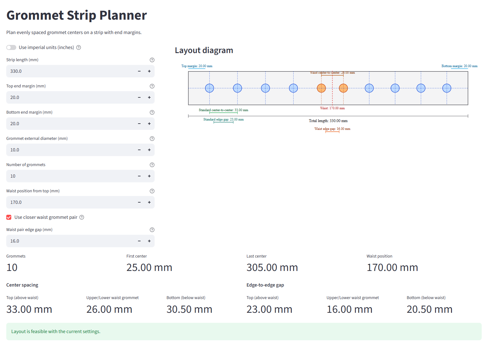
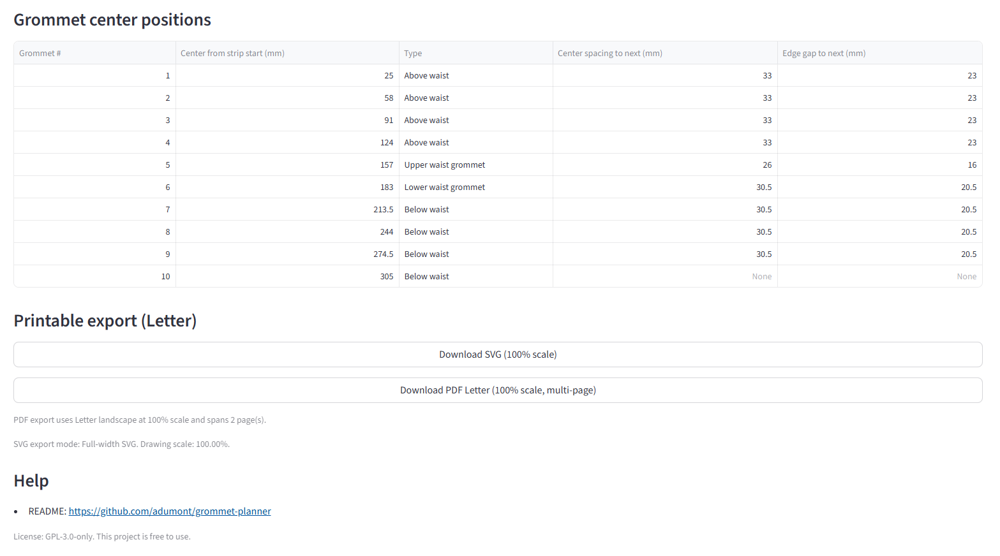

# Grommet Strip Planner

A small web app that solves a very specific sewing problem: **how to evenly place grommets on a corset lacing strip** so the spacing looks clean and professional, and the waist grommets land exactly where you need them.

**Use the app: [grommet-planner.streamlit.app](https://grommet-planner.streamlit.app/)**

---

## The Problem It Solves

When lacing a corset, grommets are set into a fabric strip along the centre-back edges. Getting the spacing right by hand is tedious — you have to account for:

- The total length of the strip
- A margin at each end (so grommets don't tear out)
- The physical size of each grommet (its external diameter)
- An even gap between grommets so the lacing looks uniform
- A **closer pair at the waist** — a traditional corset feature where the two grommets at the narrowest point are placed closer together so the lacing cinches more tightly there

This app does all the maths instantly and shows you exactly where to mark each grommet centre on your fabric, and you can even print the results.

---

## Screenshots

---

## Features

### Inputs (left panel)
| Field | What it does |
|---|---|
| **Strip length (mm)** | Total length of your grommet strip |
| **Top end margin (mm)** | Empty space at the top end before the first grommet |
| **Bottom end margin (mm)** | Empty space at the bottom end after the last grommet |
| **Grommet external diameter (mm)** | The outer diameter of your grommets |
| **Number of grommets** | How many grommets to place |
| **Waist position from strip start (mm)** | Where the waist falls, measured from the top of the strip |
| **Use closer waist grommet pair** | Enable the corset waist feature |
| **Waist pair edge gap (mm)** | The edge-to-edge space between the two waist grommets (only when the waist option is on) |

You can switch units with **Use imperial units (inches)**. The app converts automatically and keeps calculations precise internally.

### Layout diagram
A live SVG diagram in the app shows:
- The strip outline with top and bottom margins marked in blue (each shown independently)
- All grommet circles (waist grommets highlighted in orange)
- A horizontal centre line through all grommet centres
- A red dashed waist marker
- Dimension annotations: standard centre-to-centre, standard edge gap, waist centre-to-centre, and waist edge gap

### Metrics
Key measurements are displayed in a summary row:
- Number of grommets, first centre, last centre, waist position
- **Center spacing** broken down into Top (above waist) / Upper-Lower waist grommet / Bottom (below waist)
- **Edge-to-edge gap** broken down the same way

### Grommet centre positions table
A precise table listing every grommet with:
- **Position** from the strip start (in mm or inches, based on selected unit)
- **Type**: Above waist / Upper waist grommet / Lower waist grommet / Below waist / Standard
- **Centre spacing to next** grommet
- **Edge gap to next** grommet

### Printable export
- **Download SVG (100% scale)** — a full-size SVG you can open in a browser or Inkscape and print at 100%, then cut out and use directly on your fabric as a marking template
- **Download PDF Letter (100% scale, multi-page)** — the same template tiled across US Letter pages (landscape), automatically spanning as many pages as needed; includes alignment guides to join pages together. It also prints fine on **A4 paper** as long as you keep printing at **100% / Actual size**.

Both exports embed all your input parameters and show measurements in **both mm and inches** so the template is self-documenting.

---

## How to Use

Go to https://github.com/adumont/grommet-planner:

### 1. Enter your measurements

Start with just the basics:
1. Choose units: **mm** or **inches**
2. Enter your **strip length**, **top end margin**, and **bottom end margin**
3. Enter your **grommet diameter** (the external/outer diameter stamped on the packet)
4. Set the **number of grommets** you want

The diagram updates instantly as you type.

### 2. Optional: add the waist pair

1. Enter the **waist position** — measure from the top of your strip to where the waist sits on the body
2. Tick **Use closer waist grommet pair**
3. Adjust the **waist pair edge gap** — typically 2–5 mm, narrower than your standard gap

The app will automatically distribute the remaining grommets proportionally above and below the waist based on available space.

### 3. Check the results

- Confirm the **edge gaps are positive** (no grommet overlap)
- Read off the **centre positions** from the table — these are the points you mark on your fabric
- The spacing should look even in the diagram

### 4. Export a template

Click **Download PDF Letter** and print at **100% / Actual size** (do **not** use "fit to page").  
Cut along the strip outline and pin to your fabric to transfer the grommet centre marks.

---

## Tips

- The **grommet diameter** is the outer ring, not the hole. Check the packaging — it is usually printed in mm.
- You can work in inches if preferred; exports always include both **mm and inches** for clarity.
- If you get a **"Grommets overlap"** warning, either reduce the number of grommets, increase the strip length, or use smaller grommets.
- Top and bottom end margins can be set independently — useful when the top and bottom of the corset need different seam allowances.
- For a standard corset, the waist gap is typically **2–4 mm** (noticeably tighter than the regular gap).
- When printing the PDF, always verify scale with a ruler against the "Total length" dimension printed on the template before cutting.

---

## License

This project is licensed under **GPL-3.0-only** and is free to use.
